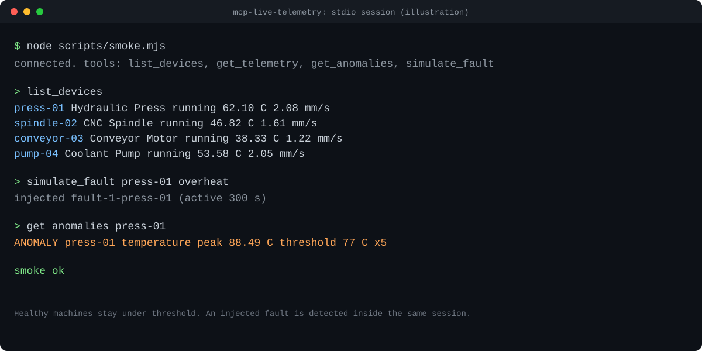

# mcp-live-telemetry

[](https://github.com/Younes-Alaoui-Ismaili/mcp-live-telemetry/actions/workflows/ci.yml)
[](LICENSE)

A [Model Context Protocol](https://modelcontextprotocol.io) server that exposes live industrial IoT telemetry to any MCP client. It streams simulated sensor data from a small fleet of machines, detects anomalies against per device thresholds, and lets you inject a fault on demand so the whole loop is visible in a single session.

The simulator is deliberately isolated behind a thin boundary so it can be swapped for a real data source without touching the tools. See [Adapting this to your data source](#adapting-this-to-your-data-source).



*An illustration, not a screen capture. Readings are a function of the current timestamp, so every run prints different numbers. The unedited output of a real run is below.*

## A real session, end to end

The block below is the unedited output of `npm run smoke`, which drives the built server as a real
subprocess over stdio using the MCP client SDK. It is not an in-process shortcut, and it is not a
transcript written by hand.

```
$ npm run smoke

> mcp-live-telemetry@0.1.0 smoke
> node scripts/smoke.mjs

mcp-live-telemetry 0.1.0 running on stdio
connected. tools: list_devices, get_telemetry, get_anomalies, simulate_fault

--- list_devices ---
{
  "count": 4,
  "devices": [
    {
      "id": "press-01",
      "name": "Hydraulic Press",
      "state": "running",
      "temperature_c": 65.5,
      "vibration_mm_s": 2.116,
      "timestamp": 1785240876420
    },
    {
      "id": "spindle-02",
      "name": "CNC Spindle",
      "state": "running",
      "temperature_c": 51.67,
      "vibration_mm_s": 1.411,
      "timestamp": 1785240876420
    },
    {
      "id": "conveyor-03",
      "name": "Conveyor Motor",
      "state": "running",
      "temperature_c": 42.74,
      "vibration_mm_s": 0.943,
      "timestamp": 1785240876420
    },
    {
      "id": "pump-04",
      "name": "Coolant Pump",
      "state": "running",
      "temperature_c": 57.42,
      "vibration_mm_s": 1.796,
      "timestamp": 1785240876420
    }
  ]
}

--- simulate_fault press-01 overheat ---
Injected overheat fault on press-01, active until 2026-07-28T12:19:36.425Z. Call get_anomalies or get_telemetry to see it.

{
  "id": "fault-1-press-01",
  "device_id": "press-01",
  "type": "overheat",
  "started_at": 1785240756425,
  "ends_at": 1785241176425,
  "duration_ms": 300000
}

--- get_anomalies press-01 ---
{
  "count": 1,
  "window": {
    "start": 1785239976428,
    "end": 1785240876428,
    "step_ms": 30000
  },
  "anomalies": [
    {
      "id": "press-01:temperature:1785240756428",
      "device_id": "press-01",
      "metric": "temperature",
      "started_at": 1785240756428,
      "ended_at": 1785240876428,
      "peak_value": 93.79,
      "threshold": 77,
      "sample_count": 5
    }
  ]
}

smoke ok
```

A healthy fleet stays under its thresholds. The injected fault crosses one, and the anomaly surfaces
in the same session, through the same tools an MCP client would call. Run it yourself and the numbers
will differ: they are derived from the clock, and only the behaviour is fixed.

## Tools

| Tool | Description | Read only |
| --- | --- | --- |
| `list_devices` | List every machine with its latest reading and state. | yes |
| `get_telemetry` | Time ordered readings for one device across a window, with pagination. | yes |
| `get_anomalies` | Threshold crossings (temperature or vibration) over a window. | yes |
| `simulate_fault` | Inject a fault (`overheat`, `vibration`, or `combined`) so it surfaces live. | no |

Each tool ships a strict Zod input schema, a documented output schema, and behaviour annotations (`readOnlyHint`, `destructiveHint`, `idempotentHint`, `openWorldHint`).

## A dashboard that consumes this server

[Industrial Telemetry Dashboard](https://github.com/Younes-Alaoui-Ismaili/Industrial-telemetry-dashboard)
is a supervision screen built against this server. It calls the four tools defined above
through a small local bridge, mapping devices, readings and detected anomalies onto a
plant view with threshold alarms and acknowledgement.

**[Live demo](https://younes-alaoui-ismaili.github.io/Industrial-telemetry-dashboard/)** -
runs on a self-contained simulator, so it needs nothing installed. The live MCP mode is
local only: a page served over `https` cannot reach a server on `http://localhost`, so
selecting it on the published demo reports the server as unavailable, by design.

## Quickstart

```bash
npm install
npm run build
npm start
```

`npm start` runs the server on stdio. To try it interactively, use the MCP Inspector:

```bash
npx @modelcontextprotocol/inspector node dist/index.js
```

Or run a scripted end to end session against the built server:

```bash
npm run smoke
```

## Use it from Claude Desktop

Add the server to your Claude Desktop config (`claude_desktop_config.json`), using an absolute path to the built entry point. A ready to edit example lives in [`demo/mcp-config.example.json`](demo/mcp-config.example.json):

```json
{
  "mcpServers": {
    "live-telemetry": {
      "command": "node",
      "args": ["/absolute/path/to/mcp-live-telemetry/dist/index.js"]
    }
  }
}
```

Restart Claude Desktop, then ask it to list devices, pull telemetry for one of them, inject a fault, and check anomalies.

## Adapting this to your data source

The simulator lives entirely under `src/simulator/` and is reached only through the `Simulator` facade in `src/simulator/store.ts`. To point this server at real hardware or an existing API, replace the body of that facade (`listDevices`, `getTelemetry`, `getAnomalies`, `simulateFault`) with calls to your backend, for example a historian, an MQTT broker, or a REST endpoint. The four tools, their schemas, and their output shapes stay exactly the same, so an MCP client that works against the simulator works unchanged against your data.

## Development

```bash
npm test          # run the vitest suite
npm run test:cov  # run tests with coverage thresholds
npm run lint      # eslint
npm run build     # type check and emit dist/
```

A step by step live demo script is in [`docs/DEMO.md`](docs/DEMO.md).

## How the simulation works

Readings are a pure function of `(seed, device id, timestamp)`, so any time window is fully reproducible and a sub window always agrees with the wider window on shared timestamps. A healthy machine stays under its anomaly threshold under normal noise; an injected fault always crosses it. Faults are treated as having started two minutes before injection, so they are visible in recent telemetry immediately.

## License

MIT. See [LICENSE](LICENSE).
